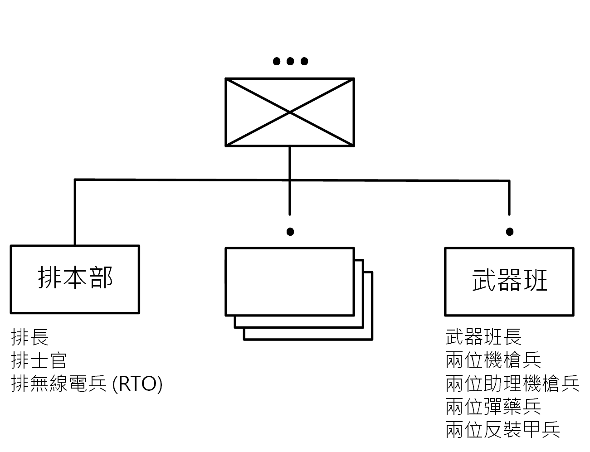
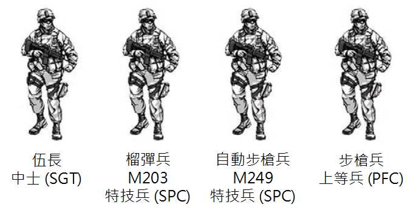

# 第三節 - 組織

## 步兵排

1-62. 一個步兵排由三個步兵班、一個武器班以及一個排本部組成。 本部組織提供 C2 (指揮與控制) 給各班與協調作戰，並作為火力支援與維持的介面。 雖然所有的步兵排在作戰中使用相同的基本準則，但是應用方式會隨著被賦予的組織與任務而有所不同。(圖 1-4)

1-63. 步兵排的一個固有強項就是任務整合能力。 步兵排本部必須要預期接受與其他士兵或者單位的指揮關係，以及引導其他武力作為支援。

圖 1-4. 步兵排

### 排本部 (Platoon Headquarter)

1-64. 排本部有三位永久成員：排長、排士官、排無線電兵 (RTO)。 根據任務組織的不同，組織可能會有些變動。 兩個一般會被另外加入的成員有火力支援小組，以及排醫護兵。

### 排長

1-65. 排長以自身為準來領導部下。 排長需對部下展示他的權威以及他對部下行動的責任。 這個集中式的權威讓排長能夠果斷地行動，同時保持部隊準則以及統一性。 在變化多端的進戰中，就算已經有縝密的計畫，排長仍需在沒有上級指導的情況下以自身的判斷力來達成任務。

#### 責任

1-66. 排長對整個排的成功與失敗負責。 在進行他的職責時，他應諮詢排士官任何關於排的事務。 他必須掌握他的士兵以及如何安排他的排與他的支援武器。 在作戰中，排長應該：

- 領導他的排以支援更高層的本部的任務。 他以被分配的任務以及更高層指揮官的意向與概念作為基準來行動。
- 調動各班與作戰單位。
- 協調各班的動作。
- 事先預見排的下一步動作。
- 請求與控制支援單位。
- 對班和排安排空閒的指揮與控制系統。
- 確保 360 度與三維空間的安全。
- 控制關鍵武器系統的佈署。
- 發出精確的定期報告。
- 將自己放在完全任務中最需要自己的地方。
- 分配明確的任務與目標給他的班。
- 了解上方兩個階層 (連級與營級) 的任務以及指揮官的意向。

#### 狀況理解 (Situational Understanding)

1-67. 排長必須發展與保持狀況理解 (SU)。 狀況理解由四個元素組成。 第一，排長嘗試理解當下友軍、敵軍、自然環境與地形的狀況。 第二，排長必須知道甚麼狀態才算是任務結束。 第三，排長必須決定哪些關鍵動作與事件能夠使部隊達到結束狀態。 最後，排長必須能夠評估各種風險。

### 排士官 (Platoon Sergeant, PSG)

1-68. 排士官是排中的資深士官與指揮的第二把交椅。 他對任何事物展示出典範。 他是步兵排與班的作戰專家，包括調動排級單位、安排所有支援武器。 排士官對排長提出任何關於管理上的、後勤的、以及戰術上的建議。 排士官對排中士兵的關心、武器以及裝備負責。 因為排士官是第二指揮官，除了排長交給他的任務外，他沒有任何正式的職責。 然而，排士官傳統上應該：

- 保證全排準備好完成任務，包括接受戰前上級的檢查與校閱。
- 準備隨時接受排長的腳色與職務。
- 為了協助 C2 接戰，在最需要他的地方行動 (無論是在提供支援火力或者突襲時)。
- 接受班長的管理、後勤與維護報告，以及關於口糧、水、油料還有彈藥的請求。
- 與更高層本部協調並請求後勤支援 (通常是跟連級第一士官或者執行官)。
- 管理各單位的戰鬥負擔，以及在戰鬥中監視後勤的狀況。
- 建立與運作單位的傷亡收集點 (casualty collection point, CCP)，包括引導排醫護兵與救援/擔架小隊運送傷患；維護排級強度等級的資訊；整合與送出全排傷亡報告；接受與調派替換人員。
- 為班與排裝備數位 C2 裝置。
- 了解上方兩個階層 (連級與營級) 的任務以及指揮官的意向。

譯注：排士官相當於中華民國陸軍編制中的副排長。

### 排無線電兵 (Platoon Radiotelephone Operator, RTO)

1-69. 排無線電兵主要負責跟他的控制本部 (通常是連級單位) 通訊。 在作戰中，無線電兵會：

- 任何時刻保持通訊。 如果失去了與上一層單位的通訊，無線電兵要知會排長與排士官。
- 在定點時與上層進行無線電確認 (遵照單位的標準程序)。 若無線電兵無法如要求進行成功的通訊，他要知會排士官或者排長。
- 做為無線電通訊程序與報告格式的專家，像是間接火力或者傷兵接送的呼叫，以及了解所有總類的簡便型天線。
- 擁有排內所有士兵都知道的個人頻率以及呼叫代號。
- 協助排長管理訊息。
- 協助排長與排士官給各班與排裝備空閒的數位 C2 系統。
- 在作戰前決定他的作戰負擔，以及在作戰管理電池。

### 前進觀測兵 (Forward Observer, FO)

1-70. 前進觀測兵與火力支援無線電兵都是計劃與執行間接火力的專家 (SME)。 前進觀測兵是所有火力支援 (fire support, FS) 的主要觀測者，包括連級迫擊砲 (如果有分配的話)、營級迫擊砲、野戰砲、以及任何其他分配的火力支援組件。 他負責定位目標、呼叫及調整間接火力。 他必須了解任務以及作戰的概念，特別是排級的調動方式與對於火力的概念。 他直接為排長工作，並與更高層本部的火力支援代表交流。 前進觀測兵也要：

- 知會火力支援小組本部關於排的狀況、位置與火力支援的需求。
- 準備以及使用地圖、覆蓋圖與地形素描。
- 呼叫與調整間接火力。
- 與火力支援無線電兵作為一個團隊工作。
- 選擇目標以支援排的任務。
- 選擇觀測點 (observation post, OP) 以及從或者到選定目標的移動路徑。
- 運用數位訊息裝置與維持與營級與連級的火力支援官 (fire support officer, FSO) 的通訊。
- 保持他的地點的座標。
- 如果需要的話隨時準備替代排長的無線電以連接更高層的本部通訊網。
- 隨時準備使用近點空中支援裝置。

### 排醫護兵 (Platoon Medic)

1-71. 排醫護兵被配置在營級醫療排，並隨時根據命令調任。 他的主要任務是強行進行醫療保護。 因此他是照護與傷患撤離的專家。 他直接為排士官工作。 然而，他也大量地與連級高階醫護兵直接互動。 在作戰中，醫護兵會：

- 照護傷亡、提供救援與擔架小隊以供撤離。
- 向排長與排士官提供強制健康保護上的建議，以及親自確認排員的健康與身體狀況。
- 報告所有醫護狀況與對排士官採取的行動。
- 向連醫護兵為所屬排請求第八類 (醫護) 補給。
- 向戰鬥救護員提供訓練與指導。

## 步兵伍 (Infantry Fire Team)

1-72. 步兵伍是被設計來作為一個小隊戰鬥，並且是步兵排中的戰鬥基本單位。 步兵排與班的成功與失敗都是建立在伍的行動之上。

1-73. 步兵伍是被設計成一個自足的小隊 (圖 1-5)。 自動步槍兵 (AR) 提供內部的掩護火力，並且具備對區域目標提供持續的小型優勢火力的能力。 步槍兵 (RFLM) 提供精準且致命的直接火力到單點目標。 榴彈兵 (GRN) 提供高爆間接火力到區域與單點目標上。 伍長 (TL) 透過以自身為模範 (「跟隨我一起做！」) 提供指揮與控制 (C2) 並領導他的小隊。

圖 1-5. 步兵伍

譯註：中華民國陸軍中並沒有特技兵 (specialist, SPC) 的軍階存在。 在美國陸軍中，特技兵位於上等兵 (PFC) 之上，下士 (CPL) 之下，並擁有與下士相同的薪資階級 E4。 特技兵是美國陸軍之中，士兵的最高階級，也是最多人擁有的軍階。 上等兵服務滿兩年並且表現優異之後即會晉升為特技兵。 另外，具有四年大學學位的新招募生或軍官候選人也會直接被任命為特技兵。

### 步槍兵 (Rifleman, RFLM)

1-74. 步槍兵作為所有步兵最基本的標準，並且是伍中最主要的成員。 他必須作為能夠處理與使用他的武器的專家。 他的主要工作是精準且高效地攻擊他的敵人。 除此之外，步槍兵必須：

- 作為自己我武器系統的專家，包括他的步槍、瞄準鏡與雷射瞄準器。 他必須在白天或晚上有效地利用他的武器。 他必須有能力以精準的射擊迎擊所有目標。
- 有能力使用全班的各種武器，以及常見軍事用品。
- 有能力建立或者佔領一個快速射擊位置，然後知道該如何從該位置射擊。 他必須知道如何在各種環境快速佔據掩蔽點或是隱密處，以及這些地點如何從直接火力之中保護他。 他必須在配戴夜視鏡的時候也能夠勝任這些工作。
- 能夠作為他的單位中的一份子作戰，包括精通他的個人工作與演練、能夠與他的隊友並肩作戰、了解他的隊友的職責、隨時準備在必要時使用他們的武器。
- 能夠作為特殊團隊的成員貢獻，包括掃雷小組、搜索戰俘 (EPW)、救護與擔架、拆除。
- 能夠在一個戰術狀況之中，通知伍長任何他所聽見或看見的事物。
- 能夠進行單兵醫療預防措施 (preventive medicine measures, PMM) (詳見第六章)。
- 能夠依照要求對同伴實施救護。
- 能夠在作戰中管理他的食物、水與彈藥。
- 隨時準備接替自動步槍兵與伍長的職責。
- 了解以上兩階層 (班級與排級) 的任務。

### 榴彈兵 (Grenadier, GRN)

1-75. 擲彈兵現在裝備一把 M203 武器系統，包括一把 M16/M4 步槍以及一個附加的 40 公釐榴彈發射器。 榴彈提供了伍一種遠達 350 公尺的高拋物線、高爆炸力的能力。 他的火力使得伍具備高拋物線、高爆炸力的武力以及其他低角度武器。 榴彈發射器使得榴彈兵能夠施展三種作用： 利用高爆 (HE) 或者高爆兩用彈 (HEDP) 來壓制以及摧毀敵方步兵和輕裝載具； 提供煙霧以遮蔽或者掩護他的班的火力與移動； 以及佈署曳光彈來增加他的班的能見度和標示敵人位置。 榴彈兵必須：

- 能夠完成所有步槍兵的任務。
- 能夠在白天以及夜晚利用適當的彈藥迎擊敵人。
- 利用形狀與顏色分辨 40 公釐的彈藥。 他必須知道如何使用各種彈藥，以及了解最低安全限制。
- 了解對他的榴彈發射器而言，任何種類的目標的最大範圍。
- 不需要看刻度也能了解立視標尺的遞增 (leaf sight increments) 有多少。
- 了解第一次射擊之後該如何調整以讓第二次射擊命中。
- 在所有的射擊位置以及跑步時快速裝填榴彈發射器。
- 隨時準備接替自動武器槍手與伍長的職責。
- 了解以上兩階層 (班級與排級) 的任務。

### 自動步槍兵 (Automatic Rifleman, AR)

1-76. 自動步槍兵的主要武器目前是 5.56 公釐 M249 機槍。 M249 提供單位一種對區域目標的大量且持續的壓制與殺傷火力。 自動步槍兵利用 M249 對步兵與碉堡進行壓制、摧毀敵方自動步槍與反坦克小隊、以及協助其他小隊與班的行動。 他通常會是伍之中的高級士兵。 自動步槍兵必須：

- 能夠完成所有步槍兵與榴彈兵的任務。
- 隨時準備接替伍長與班長的職責。
- 能夠使用自動火力接戰一群單兵、輕裝兵器、碉堡門或是槍眼、以及疑似有敵人的位置等等。 他對這些目標實施壓制火力，讓他的隊友能夠接近並摧毀敵軍。
- 熟悉野外助力射擊輔助器 (field expedient firing aids)，以增加武器的效率。 (例如：瞄準樁)
- 能夠用方便的姿勢、跪姿與站姿，以及在有或沒有夜視設備的情形下接戰敵人。 並且了解以上兩階層 (班級與排級) 的任務。

### 伍長 (Team Leader, TL)

1-77. 伍長以自身為榜樣帶領隊員。 他對部下具有權威並且對他們的行為負責。 集中式的權位讓伍長可以維持部隊教條與統一性以讓小隊可以果斷行動。 在變化多端的近戰中，伍長必須在沒有上層指示的情況下用直覺完成指定的任務。

1-78. 伍長在戰場中的位置必須要能直接且精確地應付他的所有行動。 他以自身為榜樣帶領隊員戰鬥。 伍長對他的全隊的所做與失敗負責。 他負責關心他的隊員、武器與裝備。 在作戰中，伍長要：

- 必須是伍中所有武器與責任位置，還有所有班級戰鬥演習的專家。
- 領導他的伍交火與移動。
- 控制伍的移動與火力的比例和分布。
- 使用對班與排開放的數位指揮與控制系統。
- 確保伍所屬的範圍安全。
- 依照要求協助班長。
- 隨時準備接替班長與排士官的職責。
- 執行戰場守則與醫學預防措施 (PMM)。
- 決定他的伍的戰鬥量與依照要求管理他所負責的補給。
- 了解以上兩階層 (班級與排級) 的任務。

1-79. 在調動伍的時候，伍使用以下三種技巧之一進行戰鬥：

1. 個人移動技巧 (IMT, 最低階的移動)
2. 雙人小組交火與移動。
3. 伍級交火與移動 (調動)。

1-80. 必須要根據敵人的火力效率與可用的掩護和隱蔽來決定該用哪種技巧。 敵人的火力效率越高，就用越低階的技巧。 因為伍長帶領他的伍，他能夠即時做此評估。 其他長官必須要理解伍長對於移動的決定。

## 步兵班 (Infantry Squad)

1-81. 步兵有幾種變形，但是目前只有一種步兵班 (圖 1-6)。 其主要職責為調動與支援的基本單位。 排的任務編組可能會改變，但是班的組成基本上是保持在同一個標準。

1-82. 步兵班是所有戰術任務編組的模範。 其包含兩個伍與一個班長。 其具備建立支援點，為其他單位提供安全，或是在有其他支援的情況下開火與移動的能力，同時其他伍可以移動到下一個優勢地點或者完成目標。 班長下屬有兩位伍長讓他能夠掌控整個班。

圖 1-6. 步兵班

### 班長 (Squad Leader, SL)

1-83. 班長以自身為模範引導伍長。 他對部下具有權威並且對他們的行為負責。 集中式的權位讓班長果斷行動同時維持部隊教條與統一性。 在變化多端的近戰中，甚至是在縝密計畫的行動中，班長必須在沒有上層指示的情況下用直覺完成指定的任務。

1-84. 班長是班中的高階步兵，並且對全班所作與失敗負責。 班長負責關心他的隊員、武器與裝備。 他透過兩位伍長領導他的班。 在作戰中，班長要：

- 是所有戰鬥訓練與個人訓練的專家。
- 是班上使用特殊武器與支援裝備的專家。
- 了解所有彈藥造成的武器效果、危險區域 (SDZ) 與預期危險距離 (RED)。
- 高效地運用直接火力、間接火力與戰術移動的控制措施。
- 掌控他的班的移動與火力比例和分布 (包含呼叫與調整火力)。
- 與兩個伍和可用的支援火力利用交火與支援技巧進行近戰。
- 在防衛時選擇伍的位置與負責區域。
- 定時通訊與精確的現場報告 (SPOTREPs) 與狀況報告，包括...
    - 大小、活動、地點、單位、時間、裝備 (SALUTE)。
    - 向排長回報狀況 (班的位置、進程、敵人狀況、敵人傷亡、安全狀態)。
    - 向排士官回報彈藥、傷亡、裝備的狀況。
- 裝備對班和排開放的指揮和控制系統。
- 在各種環境包括巷戰中作戰。
- 執行部隊領導程序 (troop-leading procedures, TLP)。
- 隨時準備依照要求接替排士官與排長的職責。
- 了解以上兩階層 (排級與連級) 的任務。

### 班選拔射手 (Squad Designated Marksman, SDM)

譯註：選拔射手 (Designated Marksman) 是美國陸軍中被認證在中短距離 (800 公尺以內) 具有極佳精準度的步槍兵。

1-85. 班選拔射手並不是班狙擊手。 他們是步槍班中的中堅成員，並對步槍班提供強化的能力。 他們不像狙擊手使用半自動武器在戰場上作戰，也不會像狙擊手一樣在極遠距離交戰。 選拔射手使用光學強化的通用武器。 他也接受單位內的資源進行訓練，以強化班的中短程精準作戰能力。

1-86. 一個步槍兵可能會被指定為班選拔射手 (SDM)。 挑選班選拔射手的基準為射擊能力、成熟度、可靠度、優良判斷力以及經驗。 班選拔射手必須能夠執行各種班內的個人與合作的步槍兵任務 (參見 FM 3-22.9 Rifle Marksmanship M16A1, M16A2/3, M16A4, and M4 Carbine)。

1-87. 選拔射手使用光學強化的通用武器，並接受單位內的資源進行訓練，以強化班的中短程精準作戰能力。 相反地，狙擊手使用特化步槍與特製彈藥，並且是被特別選出與訓練，以提供中長距離的精準射擊 (通常會從一個靜止位置射擊)。

1-88. 班選拔射手接戰對象為可見的單點目標，並具有以下優先順序：敵人領導、具備無線電的人、自動武器人員、有火箭發射器的敵軍士兵或狙擊手或是其他被他班長或排長指定的對象。 他對於那種只會出現部分身影或是短暫出現的目標非常有效。 一個選拔射手能有效地對非常小的目標送出火力，像是槍眼、射擊縫、碉堡觀察口、部分遮掩並俯臥中的敵人狙擊手、接近中距離的武器部隊、快速移動的目標等等。 他並需要能夠發現並且以非常不舒服、或是非標準的射擊位置接戰，甚至是在他、對方、或者兩方皆在移動時。

1-89. 每伍一個選拔射手成就了兩個高度彈性與穩定的隊伍，同時每伍也包含一個班自動步槍、榴彈發射器、與精準射擊步槍兵。 這個組合增加了狀況感知度與利用精準射擊和區域壓制奪取目標的可能。 每伍加入一個選拔射手讓班可以獲得超越敵人個體、支援武器或是小型單位的優勢，同時又能調動到優勢位置。

#### 裝備

1-90. 選拔射手使用指定的武器，通常是 M16 或 M4 搭配光學瞄準鏡。 光學瞄準鏡提供的放大與廣角效果讓他能夠觀察、偵測、辨識、測距和接戰某些用機械瞄準器與肉眼無法看到的目標。 這點強化了班的狀況認知能力以及殺傷力。 伸縮瞄準鏡極大地增加了第一槍集中在未知距離的目標的可能性，以及大幅提升了在光源不佳的情況下辨識隱蔽目標的能力。

#### 訓練

1-91. 選拔射手必須要接受針對他的新腳色與作戰和保養他的光學瞄準鏡的額外訓練。 額外訓練包括：

- 歸零技巧。
- 偵測目標。
- 測量距離、風力與移動中的目標。
- Hold-off determination. (譯注：不確定是甚麼意思)
- 備用與非標準射擊位置。
- 600 公尺內的已知戰場射擊。
- 進戰射擊技巧。
- 轉換射擊接戰。
- 快速目標辨識與接戰。
- 在有無夜視設備的情況下進行夜間射擊。
- 在前進、側走與後退時射擊。
- 從載具射擊。

#### 戰鬥任務

1-92. 選拔射手作為步兵班的一部份移動和戰鬥。 在進攻、防守與撤退作戰中，他在突擊與接戰他的武器的最大有效射擊範圍內的目標時，提供攻擊性的精準火力支援。 他在穩定作戰中的能力提供的致死、精準與具辨識力的火力建立了平息叛亂的戰鬥基礎。 他加強了班的效力以及他們調動和完成任務的能力。 在戰術調動中，選拔射手根據班長的指示提供了精準的直接火力。 他的火力限制了同儕傷害、附帶傷害以及非戰鬥傷亡。

1-93. 選拔射手在需要精準射擊對上大量火力的戰鬥狀況時非常有效。 選拔射手在以下種類的作戰中非常有用：

- 在城市作戰中，敵人與多數非作戰人員混和的群體中，或是有限制使用區域火力的準則時，班需要精準火力的情況。
- 在近戰時，需要即時且關鍵的精準步槍火力時。
- 單位正在面對具備訓練過的選拔射手或者作為狙擊手的特殊人員的敵軍且必須克服的情況。
- 具有武裝暴徒與平民的內亂。
- 載具或個人確認點作戰中，班需要一人作為武裝觀察點的情況。
- 攻擊排長或班長指定的目標時。
- 掩護突擊單位逼近與前往目標時。
- 消滅沒有任何警示就突然出現或消失在目標周遭或裡面的意外威脅時。
- 掩護前往單位位置的途徑之中的指定路徑，以及搜尋區域中反擊的跡象時。
- 利用火力孤立目標區域時。
- 為突擊單位提供聲東擊西時。
- 利用精準射擊掩護障礙或者其他重要設施時。
- 需要對光圈、暴露的人員、槍口的閃光、或是其他指定點目標進行精準射擊的情況。
- 在友軍在目標附近，以致於無法使用迫擊砲、機槍、或者榴彈發射器以防止誤傷友軍的情況。 選拔射手必須要能夠繼續進行射擊以支援進攻。

## 步兵武器班 (Infantry Weapons Squad)

1-94. 步兵武器班為排的調動提供火力基點 (base of fire)。 它包含兩個中型機槍隊、兩個中型近戰飛彈 (CCM) 隊與一個武器班長 (圖 1-7)。

圖 1-7. 步兵武器班

譯註：E3, E4, E6 是美軍的薪資階級。 每一個軍階分別對應到一個薪資階級。 以這三個薪資階級為例：上等兵 (PFC) 對應到 E3；特技兵 (SPC) 對應到 E4；中士 (SSG) 對應到 E6。

### 中型機槍隊

1-95. 兩人一組的中型機槍隊包含一位槍手 (gunner) 和一位助理槍手 (assistant gunner, AG)。 武器班有兩個機槍隊。 這些小隊為全排在白天、晚上以及不利的氣候狀況下，提供長達 1000 公尺的中距離區域壓制火力。

#### 槍手

1-96. 槍手通常是小隊中的資深成員。 在作戰中，槍手要：

- 對他的助理槍手與所有武器負責。
- 負責將槍放入或移出行動。
- 是戰場手冊「3-22.68 - 人員用機槍 5.56 毫米與 7.62 毫米」(FM 3-22.68, Crew-Served Machine Guns, 5-56-mm and 7.62-mm) 的專家。
- 當跟步槍班行動時，是使用中型機槍的專家。 他對步槍班長提議使用機槍的最佳方式。
- 在槍隊進行戰術行動時維持戰場守則。
- 了解武器對任何種類的目標造成的彈道效果。
- 協助武器班長並且準備隨時接替他的職責。
- 了解以上兩階層 (班級與排級) 的任務。

#### 助理槍手

1-97. 助理槍手是槍隊中的第二位成員。 他要準備好在任何情況下接替槍手。 在作戰中，助理槍手要：

- 持續向武器班長回報子彈數與機槍可用程度。
- 注意目標區域兩側與內部的我方士兵。
- 根據單位標準作業流程回報彈藥數量。
- 從其他攜帶彈藥的士兵取得彈藥。
- 在使用機槍時提供彈藥。
- 觀察子彈並且向槍手回報推薦修正幅度。
- 在槍手無法執行職務時立即接替他的職責。
- 了解以上兩階層 (班級與排級) 的任務。

### 近戰飛彈隊

1-98. 兩人一組的進戰飛彈隊包含一位槍手 (gunner) 和一位彈藥兵 (ammunition handler, AH)。 目前小隊使用標槍飛彈系統 (Javelin missile system)。 武器班有兩個進戰飛彈隊。 這個系統為全排提供長達 2000 公尺的極度致命、射後不理、人員可攜式、直接、上方攻擊能力，以對付敵方武裝載具以及摧毀強化據點。 標槍飛彈系統已經證實在白天、晚上與不利的天候環境都很有效。

### 武器班長

1-99. 武器班長以自身為模範引導他的團隊。 他對部下具有權威並且對他們的行為負責。 集中式的權位讓武器班長果斷行動同時維持部隊教條與統一性。 在變化多端的近戰中，甚至是在縝密計畫的行動中，武器班長必須在沒有上層指示的情況下用直覺完成指定的任務。

1-100. 武器班長通常由資深班長擔任，僅次於排士官。 他執行所有步槍班長的職責。 此外，武器班長還要：

- 控制火力與建立火力管制措施。
- 向排長建議設置機槍。
- 為機槍火力基點 (base-of-fire) 的效力直接與排長協調，並據此制定計畫。
- 監控彈藥輸出。
- 在防禦與進攻的觀測點中，為標槍飛彈系統的佈署與排長協調，以盡可能地涵蓋到敵人的裝甲勢力。
- 裝備對班和排開放的指揮和控制系統。
- 依照要求接替排士官的職責。
- 了解以上兩階層 (排級與連級) 的任務。
