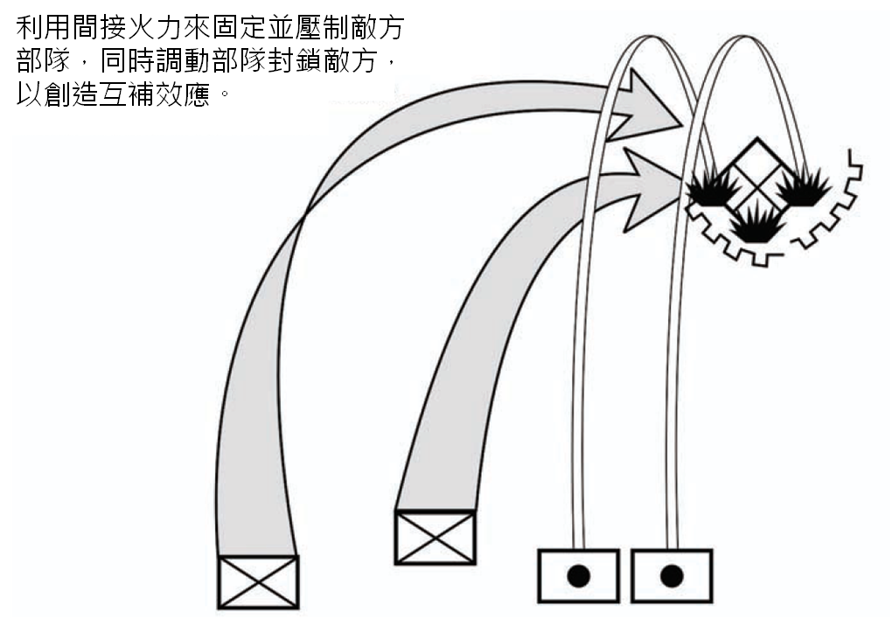
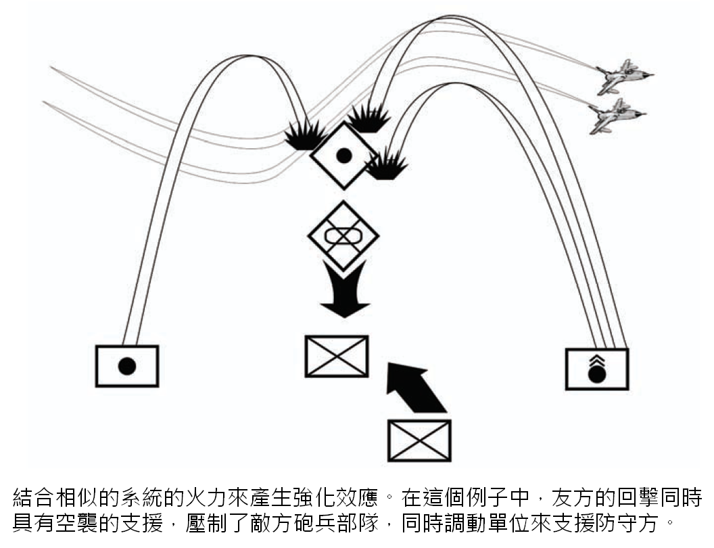
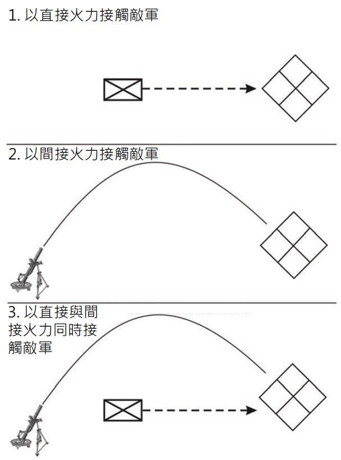

> 注意：因為美國陸軍在 2016 年發布全新手冊 ATP 3-21.8，內容差異與本書過大，因此本書停止更新。 新書位置請參考本書簡介的說明。

# 第四節 - 聯合

1-101. 陸軍喜好的作戰手段是聯合武裝 (combined arms)。 聯合武裝作戰是基於強項與弱點的概念發展出來的。 所有的武器、分支與戰術都有它的強項與弱點、優勢以及弱勢的地方。 領導們在知道這些的情況下，利用聯合的力量來保護弱點，同時善用強項來為敵人製造困境。 領導在聯合武裝的作戰中有兩項指導原則：互補效應 (complementary effect) 與強化效應 (reinforcing effect)。 這兩項原則是分開且不同的，但是在大多數的情況下很常見。

## 互補效應 (Complementary Effect)

1-102. 領導藉由分配具有不同性質的單位在一起 (圖 1-8) 來創造互補效應。 互補效應讓領導可以保護對己方有利的漏洞或增進對敵人的效果。 例如，領導可以將直接火力與具有迫擊砲或火炮的部隊組合起來，來產生比起分開配置更大的整體效果。 聯合是基於對武器、不同的分支與專長、以及戰術的強項與弱點的了解建立出來的。

圖 1-8. 互補效應

## 困境 (Dilemma)

1-103. 困境  (dilemma) 是一種敵人只能從兩到三種同樣極差的方案中選擇的情況。 問題 (problem) 是一種敵人只有一種不佳的方案 (譯註：言下之意應該是還有其他方案的意思) 的情況。 有創意的聯合可以讓領導為敵人創造困境。 當敵人遭遇困境時，會有兩種反應。 第一種反應是不知道該做甚麼，因為他們嘗試要從同樣差的選項中選擇。 這種效果我們稱之為「固定」(fixed)。 當敵人被固定時，領導就能獲得行動的自由而受益。 第二種反應是直接從兩個同樣差的選項中選擇一個。 因為友軍的勢力已經在任何敵人的選項上具有優勢，所以領導就能夠利用敵人的決定。

1-104. 選擇單一道路的話可能會導致糟糕或者失敗的結果。 依賴單一種類的武器、單一種類單位、單一戰術並不會對敵人造成困境。 只要沒有互補效應，敵人就只會遇到問題，並可以從中選出一個較好的解決方案。 就算是給予快速的連續攻擊，敵人也只要馬上撤離即可。 只要沒有第二或第三種施壓者妨礙對方做出良好決定，敵人就可以在作戰中做出反應並留在戰場上。

## 強化效應 (Reinforcing Effect)

1-105. 領導們在他們將類似的能力聯合起來時就會產生強化效應 (圖 1-9)。 一個例子是隊長利用他的步槍兵火力來強化他的班中的自動武器的效果。 領導們可以藉由同時或者連續使用此種聯合對單一定點形成集中與壓制的效果。 「同時部屬 (simultaneous employment)」強化了兩種元素的效果；「連續部屬 (sequential employment)」則相較於部屬單一元素拉長了效果持續的時間。

圖 1-9. 強化效應

### 有效率的領導利用困境來對抗敵人，而不是問題

1-106. 領導總是該想辦法對敵人造成困境 (dliemma)，而不是只有問題 (problem)。 有很多方式可以做到，包括將武器組合起來、不同種類的單位、戰術與地形等等。

1-107. 在圖 1-10 之中，一個移動中的敵方步兵部隊與靜止的友方部隊接觸。 雙方以直接火力交火。 直接火力造成了問題 (problem)，並且有解決方案。 對直接火力的普遍應對方案就是趴下並以火力回擊。 一旦問題發展下去，直接火力的效果就會逐漸減少，因為敵方會躲進掩體並回擊。

1-108. 如果友方部隊並不是以直接火力接觸，而是以間接火力接觸的話。 這也只是對敵人造成一種問題，而且同樣有解決方案。 對間接火力的普遍應對方案就是承受火力的一方要離開間接火力的爆炸範圍。 同樣地，一旦問題發展下去，間接火力的效果就會逐漸減少，因為敵方會離開爆炸範圍，並躲進可以遮掩上方的掩體。

1-109. 無論直接與間接火力的效果有多致命，這些都只會帶來問題，而且因為效果會減弱，所以這些問題都有解決方式。 假若友方部隊以直接與間接火力同時接觸，那敵人可以做甚麼？ 他們得到了一個困境：如果他們站起來就會中槍，但是他們趴下就會被炸飛。 敵人的困境主要是造就於直接與間接火力的互補效應。 這就是聯合武裝作戰的精神。

圖 1-10. 比較問題與困境的例子

1-110. 為了增加這些效果，領導們要想辦法將互補效應與強化效應組合起來。 繼續以圖 1-10 為例子，如果友方步兵有時間的話，他們可以部署障礙來阻擋敵人。 障礙的效果可以增強直接與間接火力的效果。 這三種元素同步起來對敵人造成了無法勝利的狀況。 發展交戰區域 (engagement area development) 的技術就是以此為根基。 發展交戰區域結合了直接與間接火力的互補效應以及障礙的強化效應來製造一個擊殺敵軍部隊的交戰區域。
